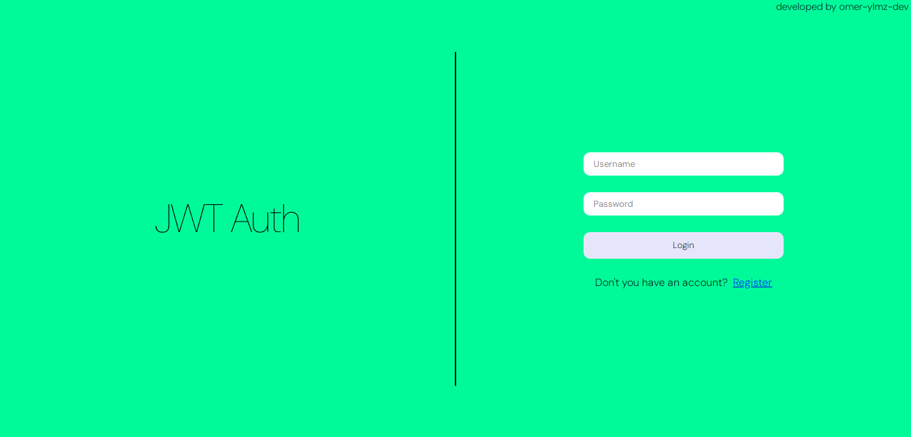
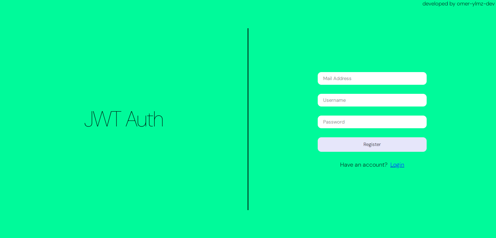
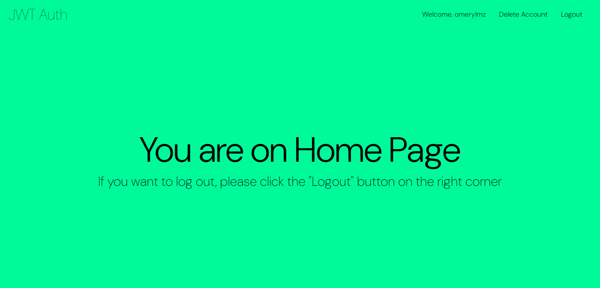
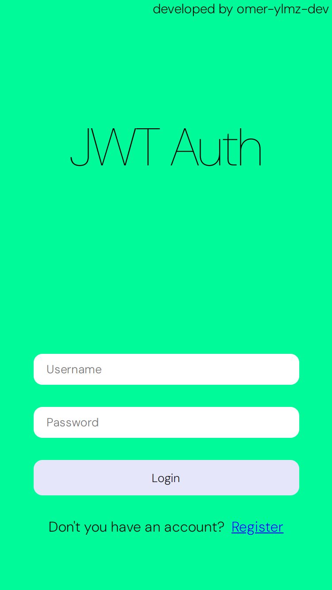
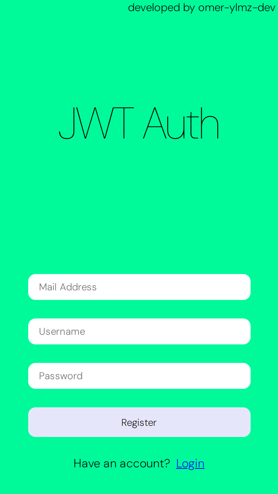
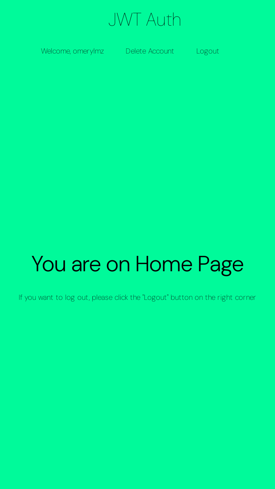

# JWT Auth - MERN - Typescript
## About


JWT Authentication Project 

Developed with Typescript

In Frontend, used Tanstack React-Query and Axios and designed with SASS/SCSS

## Development


### These were used in development :


#### Frontend 

typescript: 5.2.2

@tanstack/react-query: 5.51.15

axios: 1.7.2

crypto-js: 4.2.0

jwt-decode: 4.0.0

react: 18.3.1

react-dom: 18.3.1

react-router-dom: 6.25.1

react-toastify: 10.0.5

sass: 1.77.8

zustand: 4.5.4

#### Backend

bcrypt: 5.1.1

cookie-parser: 1.4.6

cors: 2.8.5

express: 4.19.2

jsonwebtoken: 9.0.2

mongoose: 8.5.1

@types/bcrypt: 5.0.2

@types/cookie-parser: 1.4.7

@types/cors: 2.8.17

@types/express: 4.17.21

@types/jsonwebtoken: 9.0.6

nodemon: 3.1.4

ts-node: 10.9.2

typescript: 5.5.4


#### Authentication

This app's authentication method uses JSON Web Token. If you login, you will get two tokens that called access and refresh. If your access token expired, your access token will be refreshed with refresh token. Also your access token is encrypted with AES - 256 algorithm.


### Gallery


# Desktop View

#



#
#



#
#



#
#


# Mobile View

#



#
#



#
#




### Setup


for client

```
$ cd .../client
$ npm install
$ npm run build
$ npm run preview

```


for server


```

$ cd .../server
$ npm install
$ npm run build
$ npm run start

```
